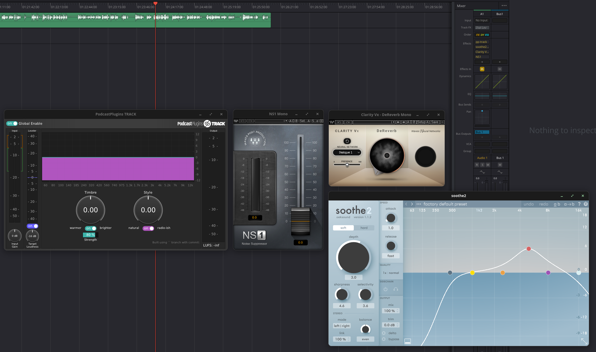
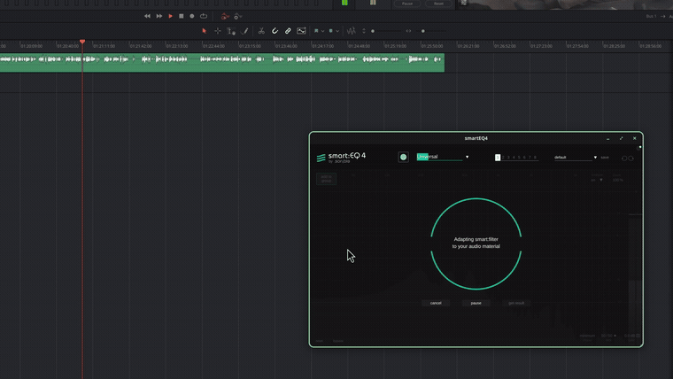
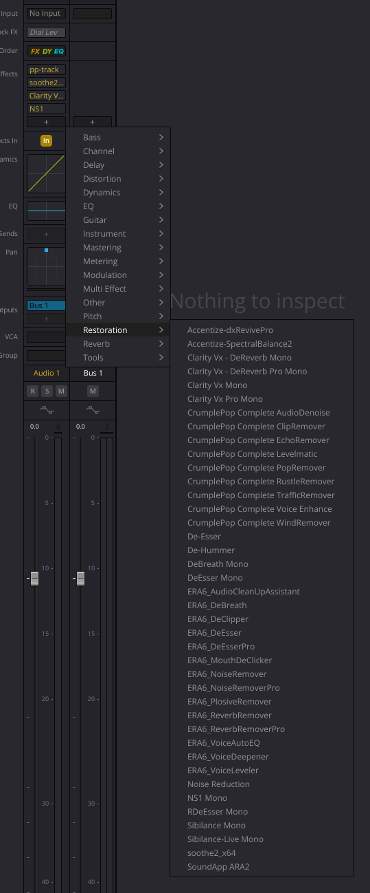
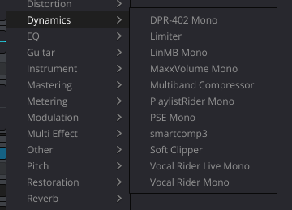
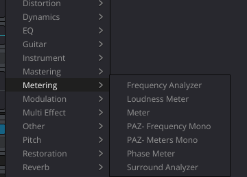

# VST for Resolve on Linux

**VST2, VST3 and CLAP plugins running inside DaVinci Resolve on Linux.** Not bounced out to an
external editor — loaded on the track, with their own GUIs, live on the timeline.

Blackmagic does not support this. Their manual lists VST as macOS and Windows only, and the Linux
build ships no VST host at all — there is not one occurrence of `VSTPluginMain` or
`GetPluginFactory` anywhere under `/opt/resolve`.



Four plugins open at once, on one track. Look at the **Effects** column in the mixer: `pp-track`,
`soothe2…`, `Clarity V…`, `NS1` — each effect carries its own name, and each is a real plugin
processing real audio.

### Sixty seconds of it, warts included



[Full recording (66s, with audio)](docs/media/demo.mp4) — several plugins loaded one after another,
ending with smartEQ4 running a live spectrum analyser while its controls are driven.

It is not a clean take, deliberately. **One plugin opens with an empty editor and only draws after
the effect is removed and undone**, and the recording keeps that in. The others open first time.

## It works

**Plugins land in Resolve's own categories**, mixed in with the built-in Fairlight FX. `De-Esser`,
`De-Hummer`, `Noise Reduction`, `Limiter`, `Multiband Compressor` and `Soft Clipper` below are
Blackmagic's; everything else is ours.

| Restoration | Dynamics | Metering |
|---|---|---|
|  |  |  |

| What | Status |
|---|---|
| **CLAP** | audio + editor |
| **VST3**, native Linux | audio + editor |
| **VST3**, Windows via yabridge | audio + editor |
| **VST2**, Windows via yabridge | audio + editor |
| **Plugin names** | each effect named on the track, not "Delay" |
| **Categories** | Dynamics, EQ, Restoration, Reverb, Metering, Pitch, Guitar… |
| **Shell plugins** | one file publishing hundreds — the Waves WaveShell exposes 718 — with a filter to choose which appear |
| **Several at once** | four plugins on one track in the shot above; no shared state between effects |

**Verified working:** soothe2 · smartEQ4 · smartComp3 · the ERA6 suite (14) · CrumplePop Complete
(9) · Accentize SpectralBalance2 and dxRevivePro · Dragonfly reverbs · Airwindows Consolidated ·
Waves (Clarity Vx, NS1, RVox, DeBreath, F6, Vocal Rider, MaxxVolume, PAZ, Sibilance and more) ·
Carla · custom CLAP plugins. **130 plugins listed** on the development machine, 75 of them from a
single Waves shell.

## It does not work, or not yet

- **Two plugins draw a GUI but take no mouse input** — Smooth Operator Pro (VST2) and Accentize
  SpectralBalance2 (VST3). Carla reproduces both, so this is not the bridge. Everything else tested
  is fully interactive.
- **A plugin editor sometimes opens empty**, and fills only after the effect is removed and the
  removal undone. Visible in the recording above. Not diagnosed; it is not tied to one format.
- **Resolve sometimes does not exit cleanly.** Undiagnosed.
- **No top-level "VST" group** like macOS and Windows show. That grouping comes from the plugin
  *type*, and Linux Resolve has no VST type. Categories work; a separate VST section cannot.
- **Audio Units** — not applicable, Apple-only format.
- **Tested on one machine**, DaVinci Resolve Studio 21. No idea how it behaves elsewhere.

> **Not a supported product.** It patches structures inside Resolve's own process at run time and
> can take Resolve down mid-edit. Save often.


## Install

Requires **DaVinci Resolve Studio 21** on Linux. The free version does not load this ABI.

### Either download the binary

Every release carries a prebuilt `libfxbridge.so`, free of cost, next to the source it was built
from.

```sh
mkdir -p ~/.local/share/BMDAudioPlugins
curl -L -o ~/.local/share/BMDAudioPlugins/libfxbridge.so \
  https://github.com/JaySNL/VSTForResolveLinux/releases/latest/download/libfxbridge.so
```

It is compiled on Ubuntu 20.04, so it asks for `GLIBC_2.16`, `GLIBCXX_3.4.22` and `CXXABI_1.3.9` at
most — libstdc++ from GCC 6.1 onward, which covers Ubuntu 18.04, Debian 9, Rocky 8 and Fedora 25 and
newer. Read the floor yourself with:

```sh
objdump -T libfxbridge.so | grep -o 'GLIBC[X]*_[0-9.]*' | sort -uV | tail -3
```

Whether **Resolve itself** runs on distributions that old is a separate question, and one this
project has not tested.

### Or build it

Needs zlib, Xlib and a C++17 compiler.

```sh
git clone --recurse-submodules https://github.com/JaySNL/VSTForResolveLinux.git
cd VSTForResolveLinux
./build.sh
```

`build.sh` compiles and installs in one step, so the file on disk is always the one just built.

### Then, either way

Point Resolve at it once, in `~/.local/share/DaVinciResolve/configs/config-fairlight.dat`:

```
BMDPlugins.Path  ~/.local/share/BMDAudioPlugins
```

Restart Resolve. The plugins are in the Audio FX panel.

**Windows plugins need a patched yabridge.** The version in your distribution's repositories draws
plugin GUIs correctly and then takes almost no mouse input — read [`docs/yabridge.md`](docs/yabridge.md)
before concluding this project is broken. Native Linux CLAP and VST3 plugins need nothing extra.

## Choosing which plugins appear

**Formats** — `FXBRIDGE_SCAN_FORMATS`, default `clap,vst2,vst3`.

**Plugins inside a shell** — `~/.local/share/BMDAudioPlugins/fxbridge-shell-allow.txt`, one
substring per line, matched against the plugin's name. Without this file a shell contributes only
its first plugin, so a 718-plugin shell never floods the menu:

```
# Selects 75 of the WaveShell's 718 plugins
Clarity Vx
RVox
Vocal Rider
DeBreath
```

**Categories** — edit `CategoryFor()` in `src/fx_categories.cpp`.

Both take effect on the next Resolve start. No rebuild.

## How it works

Resolve on Linux loads its own Fairlight FX through a private Blackmagic plugin ABI, named by a
`BMDPlugins.Path` setting that nothing documents. This library registers through that ABI, clones a
stock effect's menu definition once per scanned plugin, and claims the instance Resolve creates —
then hosts a real VST2, VST3 or CLAP plugin behind it, with its own audio buffers, its own editor
window and no state shared between effects.

- [`docs/categories.md`](docs/categories.md) — how a category is decided, and how it is set
- [`docs/yabridge.md`](docs/yabridge.md) — Windows plugins, and the branch you need
- [`docs/engineering-log.md`](docs/engineering-log.md) — how the ABI was found, and every dead end
  in order. The dead ends are most of the value.

## Prior art

No published implementation was found. `BMDAudioPluginFactory` and `QueryPluginList` return zero
hits across GitHub's indexed code, and web searches turn up only the adjacent tools —
[yabridge](https://github.com/robbert-vdh/yabridge), [LinVst](https://github.com/osxmidi/LinVst) and
[airwave](https://github.com/psycha0s/airwave) let a *DAW* load Windows plugins, which is a different
problem; this project uses yabridge underneath.

That is a search result, not a fact about the world: code search cannot see private repositories,
other forges, or a patch in a forum post. If you got here first, say so and you will be credited.

## Licence

MIT — see [`LICENSE`](LICENSE). Third-party notices in [`THIRD-PARTY.md`](THIRD-PARTY.md).

**Nothing from Blackmagic Design is copied, redistributed or modified on disk.** This loads through
Resolve's own plugin path and patches structures in its own process memory. Uninstalling is deleting
one file.

No Steinberg SDK is used: VST3 goes through [travesty](https://github.com/DISTRHO/DPF), DPF's
clean-room C headers (ISC), and VST2 through a clean-room ABI written for this project.

This is interoperability work — making software talk to plugin formats its vendor chose not to
support on one platform. In the EU, [Directive 2009/24/EC Article 6](https://eur-lex.europa.eu/legal-content/EN/TXT/?uri=CELEX%3A32009L0024)
expressly permits decompilation for interoperability. Resolve's EULA is a separate, contractual
matter; read it and decide for yourself.

For what it is worth, there is **no licensing obstacle to Blackmagic doing this themselves**. The
VST3 SDK is MIT-licensed, with no agreement to sign and no per-platform terms. The Linux gap is a
product decision, not a legal one.
